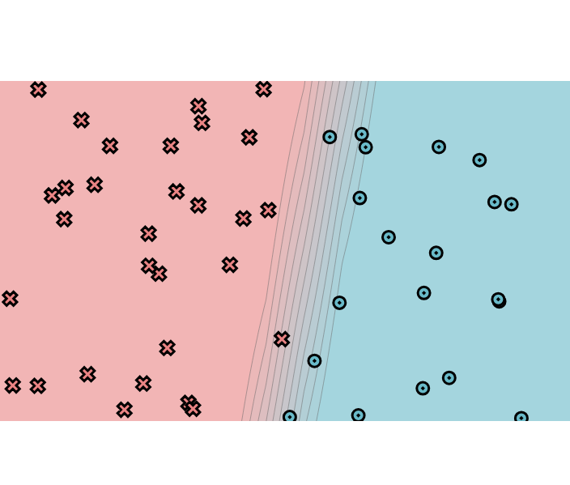
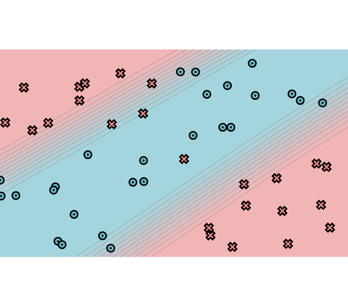
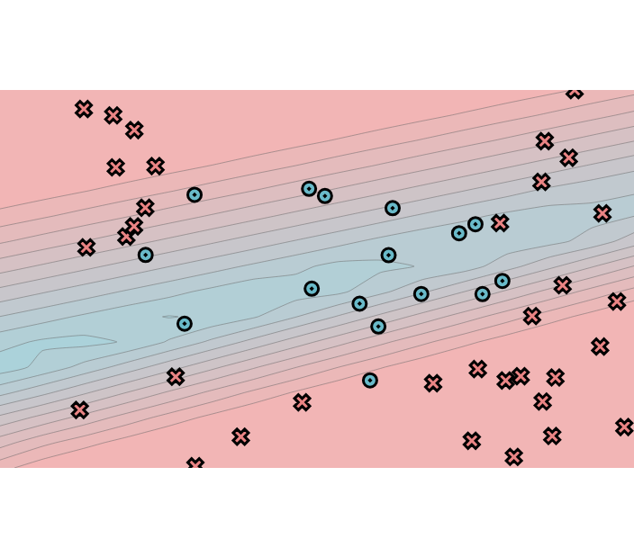
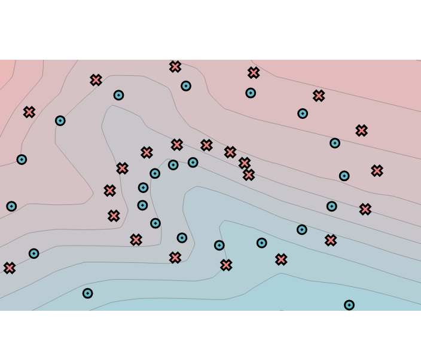

# minitorch
The full minitorch student suite. 


To access the autograder: 

* Module 0: https://classroom.github.com/a/qDYKZff9
* Module 1: https://classroom.github.com/a/6TiImUiy
* Module 2: https://classroom.github.com/a/0ZHJeTA0
* Module 3: https://classroom.github.com/a/U5CMJec1
* Module 4: https://classroom.github.com/a/04QA6HZK
* Quizzes: https://classroom.github.com/a/bGcGc12k

## 1.5 

### simple, lr = 0.05, hidden_size = 2
<details>
  <summary>Logs</summary>

Epoch: 10/500, loss: 36.51012058382242, correct: 20
Epoch: 20/500, loss: 32.827928678933866, correct: 30
Epoch: 30/500, loss: 30.874360639170945, correct: 44
Epoch: 40/500, loss: 29.63028947436925, correct: 44
Epoch: 50/500, loss: 28.497625891116396, correct: 44
Epoch: 60/500, loss: 27.390967225512604, correct: 45
Epoch: 70/500, loss: 26.279550593111757, correct: 45
Epoch: 80/500, loss: 25.120475548235888, correct: 45
Epoch: 90/500, loss: 23.91577922369517, correct: 45
Epoch: 100/500, loss: 22.6771142381467, correct: 46
Epoch: 110/500, loss: 21.424725339078897, correct: 46
Epoch: 120/500, loss: 20.173977435917752, correct: 46
Epoch: 130/500, loss: 18.93991835220538, correct: 46
Epoch: 140/500, loss: 17.745021425883596, correct: 47
Epoch: 150/500, loss: 16.596692019408348, correct: 47
Epoch: 160/500, loss: 15.5084713658211, correct: 48
Epoch: 170/500, loss: 14.498676281165322, correct: 48
Epoch: 180/500, loss: 13.56066830517654, correct: 48
Epoch: 190/500, loss: 12.695774708140869, correct: 48
Epoch: 200/500, loss: 11.89934455178074, correct: 48
Epoch: 210/500, loss: 11.173078292951596, correct: 48
Epoch: 220/500, loss: 10.51081868431142, correct: 48
Epoch: 230/500, loss: 9.906271861448834, correct: 48
Epoch: 240/500, loss: 9.35600515991435, correct: 48
Epoch: 250/500, loss: 8.853828408854092, correct: 49
Epoch: 260/500, loss: 8.395457343657979, correct: 49
Epoch: 270/500, loss: 7.976766113542093, correct: 49
Epoch: 280/500, loss: 7.593944504370881, correct: 49
Epoch: 290/500, loss: 7.243481777488154, correct: 49
Epoch: 300/500, loss: 6.92217247480105, correct: 49
Epoch: 310/500, loss: 6.627110730375818, correct: 49
Epoch: 320/500, loss: 6.355676780474615, correct: 49
Epoch: 330/500, loss: 6.10551863828502, correct: 49
Epoch: 340/500, loss: 5.8755555118247855, correct: 49
Epoch: 350/500, loss: 5.662981813566474, correct: 49
Epoch: 360/500, loss: 5.4657940366866535, correct: 49
Epoch: 370/500, loss: 5.282741958177415, correct: 49
Epoch: 380/500, loss: 5.112508074872919, correct: 49
Epoch: 390/500, loss: 4.953651479353975, correct: 49
Epoch: 400/500, loss: 4.805154295945375, correct: 49
Epoch: 410/500, loss: 4.66610560661832, correct: 49
Epoch: 420/500, loss: 4.535689289007488, correct: 49
Epoch: 430/500, loss: 4.413173250278837, correct: 49
Epoch: 440/500, loss: 4.297899892556415, correct: 49
Epoch: 450/500, loss: 4.189277685228231, correct: 49
Epoch: 460/500, loss: 4.086773726285109, correct: 49
Epoch: 470/500, loss: 3.989907183107195, correct: 49
Epoch: 480/500, loss: 3.8982435121703634, correct: 49
Epoch: 490/500, loss: 3.8113893664523597, correct: 49
Epoch: 500/500, loss: 3.728988108488055, correct: 49
</details>



### XOR, lr = 0.05, hidden_size = 10:

<details>
  <summary>Logs</summary>
Epoch: 10/500, loss: 32.0383723765653, correct: 26
Epoch: 20/500, loss: 30.602175393792788, correct: 38
Epoch: 30/500, loss: 30.1515972962497, correct: 41
Epoch: 40/500, loss: 29.759121851726352, correct: 41
Epoch: 50/500, loss: 29.382760006039252, correct: 42
Epoch: 60/500, loss: 29.016577561209267, correct: 42
Epoch: 70/500, loss: 28.647313230002393, correct: 42
Epoch: 80/500, loss: 28.2869679738191, correct: 42
Epoch: 90/500, loss: 27.914799190922274, correct: 42
Epoch: 100/500, loss: 27.527499617785608, correct: 42
Epoch: 110/500, loss: 27.131097342116153, correct: 42
Epoch: 120/500, loss: 26.73078404487996, correct: 43
Epoch: 130/500, loss: 26.301978595737513, correct: 44
Epoch: 140/500, loss: 25.85235430813335, correct: 45
Epoch: 150/500, loss: 25.34978159387393, correct: 45
Epoch: 160/500, loss: 24.84802913272276, correct: 45
Epoch: 170/500, loss: 24.299953696069817, correct: 45
Epoch: 180/500, loss: 23.678493835003817, correct: 45
Epoch: 190/500, loss: 23.059994862910603, correct: 45
Epoch: 200/500, loss: 22.45986271289528, correct: 45
Epoch: 210/500, loss: 21.878768925449307, correct: 45
Epoch: 220/500, loss: 21.328936497909893, correct: 46
Epoch: 230/500, loss: 20.699781737876094, correct: 46
Epoch: 240/500, loss: 20.02125269112187, correct: 46
Epoch: 250/500, loss: 19.258222891758123, correct: 46
Epoch: 260/500, loss: 18.65673582763691, correct: 46
Epoch: 270/500, loss: 18.141027157988976, correct: 46
Epoch: 280/500, loss: 17.607334579753225, correct: 46
Epoch: 290/500, loss: 17.120610747430387, correct: 46
Epoch: 300/500, loss: 16.72547936784455, correct: 46
Epoch: 310/500, loss: 16.38195516746268, correct: 46
Epoch: 320/500, loss: 16.073475238544923, correct: 46
Epoch: 330/500, loss: 15.783508525219814, correct: 46
Epoch: 340/500, loss: 15.515517219124474, correct: 46
Epoch: 350/500, loss: 15.268202106887681, correct: 46
Epoch: 360/500, loss: 15.036010836909252, correct: 46
Epoch: 370/500, loss: 14.817957656034716, correct: 46
Epoch: 380/500, loss: 14.613372449042123, correct: 46
Epoch: 390/500, loss: 14.42162622995159, correct: 46
Epoch: 400/500, loss: 14.242183281126687, correct: 46
Epoch: 410/500, loss: 14.074227199298964, correct: 46
Epoch: 420/500, loss: 13.916801838384798, correct: 46
Epoch: 430/500, loss: 13.769768587642577, correct: 46
Epoch: 440/500, loss: 13.6323649343262, correct: 46
Epoch: 450/500, loss: 13.503595956470722, correct: 46
Epoch: 460/500, loss: 13.383744831690635, correct: 46
Epoch: 470/500, loss: 13.272169679223174, correct: 46
Epoch: 480/500, loss: 13.167731405596598, correct: 46
Epoch: 490/500, loss: 13.069779019122187, correct: 46
Epoch: 500/500, loss: 12.977854959667512, correct: 46
</details>



### circle, lr = 0.1, hidden_size = 10


<details>
  <summary>Logs</summary>
```
Epoch: 10/500, loss: 31.714361536413477, correct: 34
Epoch: 20/500, loss: 31.348103558874683, correct: 34
Epoch: 30/500, loss: 31.13779191732157, correct: 34
Epoch: 40/500, loss: 30.97752983354569, correct: 34
Epoch: 50/500, loss: 30.83954654120559, correct: 34
Epoch: 60/500, loss: 30.718009828010516, correct: 34
Epoch: 70/500, loss: 30.60057982909479, correct: 34
Epoch: 80/500, loss: 30.484815879126554, correct: 34
Epoch: 90/500, loss: 30.373070926039354, correct: 34
Epoch: 100/500, loss: 30.26185653553408, correct: 34
Epoch: 110/500, loss: 30.148892069958187, correct: 34
Epoch: 120/500, loss: 30.03193885289092, correct: 34
Epoch: 130/500, loss: 29.911123516796113, correct: 34
Epoch: 140/500, loss: 29.790767442344002, correct: 34
Epoch: 150/500, loss: 29.669599581511406, correct: 34
Epoch: 160/500, loss: 29.550981007291412, correct: 34
Epoch: 170/500, loss: 29.43050532217009, correct: 34
Epoch: 180/500, loss: 29.306676389239946, correct: 34
Epoch: 190/500, loss: 29.179387885496467, correct: 34
Epoch: 200/500, loss: 29.046585896801314, correct: 34
Epoch: 210/500, loss: 28.904765410736836, correct: 34
Epoch: 220/500, loss: 28.75852758589742, correct: 34
Epoch: 230/500, loss: 28.60400848787047, correct: 34
Epoch: 240/500, loss: 28.44311387613187, correct: 34
Epoch: 250/500, loss: 28.278913504224803, correct: 34
Epoch: 260/500, loss: 28.091895082454556, correct: 34
Epoch: 270/500, loss: 27.85407319764174, correct: 34
Epoch: 280/500, loss: 27.474895993661434, correct: 34
Epoch: 290/500, loss: 26.934525216065268, correct: 34
Epoch: 300/500, loss: 26.5166776797307, correct: 34
Epoch: 310/500, loss: 26.255230198943323, correct: 34
Epoch: 320/500, loss: 25.973161147784293, correct: 34
Epoch: 330/500, loss: 25.69488140960173, correct: 34
Epoch: 340/500, loss: 25.446406183163482, correct: 37
Epoch: 350/500, loss: 25.207454806801675, correct: 38
Epoch: 360/500, loss: 24.97944871892894, correct: 38
Epoch: 370/500, loss: 24.757553660261113, correct: 37
Epoch: 380/500, loss: 24.54411869710595, correct: 35
Epoch: 390/500, loss: 24.228287193034937, correct: 36
Epoch: 400/500, loss: 23.90490284933836, correct: 36
Epoch: 410/500, loss: 23.681207965645065, correct: 37
Epoch: 420/500, loss: 23.463628052259203, correct: 37
Epoch: 430/500, loss: 23.265722448186057, correct: 37
Epoch: 440/500, loss: 23.07541122360425, correct: 37
Epoch: 450/500, loss: 22.895436670474822, correct: 38
Epoch: 460/500, loss: 22.72957682543761, correct: 38
Epoch: 470/500, loss: 22.503199451845692, correct: 38
Epoch: 480/500, loss: 22.29403808178523, correct: 39
Epoch: 490/500, loss: 22.094103346388536, correct: 40
Epoch: 500/500, loss: 21.90289895022671, correct: 40
</details>



### spiral, lr = 0.1, hidden_size = 20
<details>
  <summary>Logs</summary>
Epoch: 10/500, loss: 33.449800920882346, correct: 29
Epoch: 20/500, loss: 33.36711472077385, correct: 29
Epoch: 30/500, loss: 33.31446923167727, correct: 29
Epoch: 40/500, loss: 33.25861949941692, correct: 29
Epoch: 50/500, loss: 33.19843191454262, correct: 30
Epoch: 60/500, loss: 33.15224553744296, correct: 30
Epoch: 70/500, loss: 33.1199733989631, correct: 29
Epoch: 80/500, loss: 33.09145833566853, correct: 29
Epoch: 90/500, loss: 33.0644842654656, correct: 29
Epoch: 100/500, loss: 33.038439627668524, correct: 29
Epoch: 110/500, loss: 33.01224367173439, correct: 29
Epoch: 120/500, loss: 32.9769163962376, correct: 30
Epoch: 130/500, loss: 32.95146081430971, correct: 30
Epoch: 140/500, loss: 32.92778062401568, correct: 30
Epoch: 150/500, loss: 32.903156383631234, correct: 30
Epoch: 160/500, loss: 32.881311563409696, correct: 30
Epoch: 170/500, loss: 32.86085765861723, correct: 30
Epoch: 180/500, loss: 32.83949080688861, correct: 30
Epoch: 190/500, loss: 32.82088913501357, correct: 30
Epoch: 200/500, loss: 32.80178817834248, correct: 30
Epoch: 210/500, loss: 32.781443891781755, correct: 30
Epoch: 220/500, loss: 32.76404811753116, correct: 30
Epoch: 230/500, loss: 32.745584533690845, correct: 30
Epoch: 240/500, loss: 32.72760975110226, correct: 30
Epoch: 250/500, loss: 32.7090901193093, correct: 30
Epoch: 260/500, loss: 32.692155104900635, correct: 30
Epoch: 270/500, loss: 32.674231774483644, correct: 30
Epoch: 280/500, loss: 32.656929836900275, correct: 30
Epoch: 290/500, loss: 32.63810752581285, correct: 29
Epoch: 300/500, loss: 32.61817418930836, correct: 29
Epoch: 310/500, loss: 32.60130566606799, correct: 29
Epoch: 320/500, loss: 32.582373475775626, correct: 29
Epoch: 330/500, loss: 32.565533025026696, correct: 29
Epoch: 340/500, loss: 32.549156374538065, correct: 31
Epoch: 350/500, loss: 32.531905339350885, correct: 30
Epoch: 360/500, loss: 32.51469886883499, correct: 31
Epoch: 370/500, loss: 32.50049819264432, correct: 31
Epoch: 380/500, loss: 32.4823368730367, correct: 31
Epoch: 390/500, loss: 32.465822682017105, correct: 31
Epoch: 400/500, loss: 32.45004139873496, correct: 31
Epoch: 410/500, loss: 32.43048817242133, correct: 31
Epoch: 420/500, loss: 32.41326190208056, correct: 31
Epoch: 430/500, loss: 32.39600231031155, correct: 31
Epoch: 440/500, loss: 32.37635844726903, correct: 31
Epoch: 450/500, loss: 32.35679454170823, correct: 31
Epoch: 460/500, loss: 32.33989508240266, correct: 31
Epoch: 470/500, loss: 32.32213274310202, correct: 31
Epoch: 480/500, loss: 32.30454061778908, correct: 31
Epoch: 490/500, loss: 32.28440606374892, correct: 31
Epoch: 500/500, loss: 32.26689301519228, correct: 31
</details> 




## 2.5 

## linear, lr = 0.05, hidden_size = 4, total_time = 51.5s
<details>
  <summary>Logs</summary>
Epoch: 0/500, loss: 0, correct: 0
Epoch: 10/500, loss: 30.011731699307262, correct: 32
Epoch: 20/500, loss: 29.31476900408179, correct: 35
Epoch: 30/500, loss: 28.619330824942566, correct: 36
Epoch: 40/500, loss: 27.942407467098242, correct: 38
Epoch: 50/500, loss: 27.270162861043833, correct: 39
Epoch: 60/500, loss: 26.58369196683974, correct: 40
Epoch: 70/500, loss: 25.871114550426793, correct: 41
Epoch: 80/500, loss: 24.918334230871444, correct: 42
Epoch: 90/500, loss: 23.592660289752292, correct: 42
Epoch: 100/500, loss: 22.717765451636875, correct: 43
Epoch: 110/500, loss: 21.848289516033542, correct: 44
Epoch: 120/500, loss: 20.98068477033182, correct: 45
Epoch: 130/500, loss: 20.11528820432512, correct: 45
Epoch: 140/500, loss: 19.25574771024319, correct: 45
Epoch: 150/500, loss: 18.40664882752918, correct: 45
Epoch: 160/500, loss: 17.57285550621055, correct: 47
Epoch: 170/500, loss: 16.776026326262972, correct: 49
Epoch: 180/500, loss: 16.023630512133735, correct: 49
Epoch: 190/500, loss: 15.297956992255255, correct: 49
Epoch: 200/500, loss: 14.609451765299344, correct: 49
Epoch: 210/500, loss: 13.951595554547469, correct: 50
Epoch: 220/500, loss: 13.319476423539461, correct: 50
Epoch: 230/500, loss: 12.71746440434563, correct: 50
Epoch: 240/500, loss: 12.157743723139262, correct: 50
Epoch: 250/500, loss: 11.641123890765444, correct: 50
Epoch: 260/500, loss: 11.150892352928855, correct: 50
Epoch: 270/500, loss: 10.684475868092054, correct: 50
Epoch: 280/500, loss: 10.240992908433014, correct: 50
Epoch: 290/500, loss: 9.819639443399351, correct: 50
Epoch: 300/500, loss: 9.425706191934982, correct: 50
Epoch: 310/500, loss: 9.058183991007262, correct: 50
Epoch: 320/500, loss: 8.709710777449455, correct: 50
Epoch: 330/500, loss: 8.379226720642727, correct: 50
Epoch: 340/500, loss: 8.06593200673516, correct: 50
Epoch: 350/500, loss: 7.769129559042104, correct: 50
Epoch: 360/500, loss: 7.487811923931042, correct: 50
Epoch: 370/500, loss: 7.222623302224161, correct: 50
Epoch: 380/500, loss: 6.972878119083826, correct: 50
Epoch: 390/500, loss: 6.7405240201871734, correct: 50
Epoch: 400/500, loss: 6.521778200690516, correct: 50
Epoch: 410/500, loss: 6.317034801987079, correct: 50
Epoch: 420/500, loss: 6.123418231112208, correct: 50
Epoch: 430/500, loss: 5.940614691586487, correct: 50
Epoch: 440/500, loss: 5.76807333895563, correct: 50
Epoch: 450/500, loss: 5.605367798664014, correct: 50
Epoch: 460/500, loss: 5.451792395132254, correct: 50
Epoch: 470/500, loss: 5.3072498103318955, correct: 50
Epoch: 480/500, loss: 5.169660119432821, correct: 50
Epoch: 490/500, loss: 5.038508099745892, correct: 50
Epoch: 500/500, loss: 4.913186603326338, correct: 50
</details> 

## spiral, lr = 0.05, hidden_size = 4, total_time = 53.5s

<details>
  <summary>Logs</summary>
Epoch: 0/500, loss: 0, correct: 0
Epoch: 10/500, loss: 34.792283799790006, correct: 25
Epoch: 20/500, loss: 34.748965207013924, correct: 23
Epoch: 30/500, loss: 34.72088030900396, correct: 25
Epoch: 40/500, loss: 34.70114153993449, correct: 26
Epoch: 50/500, loss: 34.68598853332042, correct: 25
Epoch: 60/500, loss: 34.673387735969655, correct: 27
Epoch: 70/500, loss: 34.66224638128479, correct: 27
Epoch: 80/500, loss: 34.65197832777928, correct: 26
Epoch: 90/500, loss: 34.64226887757953, correct: 25
Epoch: 100/500, loss: 34.63295225034706, correct: 24
Epoch: 110/500, loss: 34.624224288176784, correct: 25
Epoch: 120/500, loss: 34.615868847355564, correct: 25
Epoch: 130/500, loss: 34.607782976322234, correct: 25
Epoch: 140/500, loss: 34.599938240005926, correct: 25
Epoch: 150/500, loss: 34.59231408930243, correct: 25
Epoch: 160/500, loss: 34.5848943573318, correct: 26
Epoch: 170/500, loss: 34.57766544921489, correct: 26
Epoch: 180/500, loss: 34.57070161898054, correct: 26
Epoch: 190/500, loss: 34.56392036969428, correct: 26
Epoch: 200/500, loss: 34.55730584121979, correct: 26
Epoch: 210/500, loss: 34.55084521224747, correct: 26
Epoch: 220/500, loss: 34.54453202210032, correct: 26
Epoch: 230/500, loss: 34.538360240941884, correct: 25
Epoch: 240/500, loss: 34.53231397544623, correct: 25
Epoch: 250/500, loss: 34.526396286187214, correct: 25
Epoch: 260/500, loss: 34.520589626780044, correct: 26
Epoch: 270/500, loss: 34.51489485592785, correct: 26
Epoch: 280/500, loss: 34.509304451207214, correct: 26
Epoch: 290/500, loss: 34.503808641099624, correct: 26
Epoch: 300/500, loss: 34.49840500848078, correct: 26
Epoch: 310/500, loss: 34.493093197782215, correct: 26
Epoch: 320/500, loss: 34.48785909967058, correct: 26
Epoch: 330/500, loss: 34.4827021567147, correct: 26
Epoch: 340/500, loss: 34.477618458586875, correct: 26
Epoch: 350/500, loss: 34.47260395813135, correct: 26
Epoch: 360/500, loss: 34.46765539038491, correct: 26
Epoch: 370/500, loss: 34.46277088580592, correct: 26
Epoch: 380/500, loss: 34.457943822550746, correct: 26
Epoch: 390/500, loss: 34.453170024804635, correct: 26
Epoch: 400/500, loss: 34.448448398684036, correct: 26
Epoch: 410/500, loss: 34.44377607345344, correct: 26
Epoch: 420/500, loss: 34.439150392072776, correct: 26
Epoch: 430/500, loss: 34.434568822367346, correct: 26
Epoch: 440/500, loss: 34.43002895202377, correct: 26
Epoch: 450/500, loss: 34.425528549984946, correct: 26
Epoch: 460/500, loss: 34.421065486054964, correct: 26
Epoch: 470/500, loss: 34.4166438730787, correct: 26
Epoch: 480/500, loss: 34.41230081104345, correct: 26
Epoch: 490/500, loss: 34.407994734375706, correct: 26
Epoch: 500/500, loss: 34.40372422089354, correct: 26
</details>
